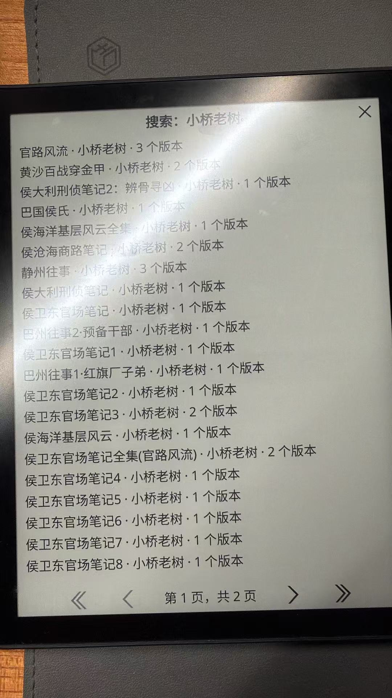

# BookCloud · 云书库

### 让 Kobo 不止能读书，还能直接找书。

想读一本书，却要先在手机或电脑上搜索、下载，再传到 Kobo？

BookCloud 把搜书这一步带回阅读器。像使用「开源阅读」一样，在 Kobo 上输入书名或作者，搜索已配置的书源、选择版本，下载后直接打开阅读。

**从找书到读书，在阅读器上完成。**

[下载安装包](https://github.com/boboyu1215/koreader-bookcloud/releases) · [开始安装](docs/INSTALL.md) · [书源说明](docs/SOURCES.md) · [反馈问题](https://github.com/boboyu1215/koreader-bookcloud/issues) · [English](README.en.md)

> **公开测试版**：基于 KOReader，由阅读器插件和自建服务端组成。需要一台已安装 KOReader 的阅读器，以及可供设备访问的 HTTPS 服务。本项目不提供公共搜书服务，也不等同于完整兼容「开源阅读」。

<p align="center">
  
</p>
<p align="center"><sub>旧版真实设备照片：作者搜索与版本聚合。新版列表改为书名与信息分层，截图待补。书目取决于用户配置的来源，图片不代表预置书库。</sub></p>

## 能做什么

- **在阅读器上搜书**：输入书名或作者，浏览匹配作品。
- **选择不同版本**：查看来源、格式、语言，以及来源提供的版本信息。
- **下载后直接阅读**：保存到本地，下载完成后选择「开始阅读」，之后可离线打开。
- **更清楚的列表**：大号书名、小号作者与版本信息；长书名最多两行，长按查看完整内容，系列数字卷号自然排序。
- **配对后就能用**：电脑管理页生成 5 分钟有效的单次配对码，在阅读器上完成配置。
- **更稳的下载**：502/503 等临时错误有限重试，服务端准备好文件再传输；失败时显示来源，并可选择同一作品的其他版本。
- **接着上次找书**：最近搜索记录、已下载列表、已下载版本直接打开。
- **在电脑上管理书源**：添加、编辑、启停、导入导出，测试搜索与下载。
- **连接自己的书库**：支持 OPDS、Gutendex、自定义目录，以及部分 Legado 静态文本规则。

## 怎么开始

1. [部署服务端](docs/INSTALL.md#1-部署服务端)，取得独立的设备凭据。
2. 从 [Releases](https://github.com/boboyu1215/koreader-bookcloud/releases) 下载 `bookcloud.koplugin-*.zip`，解压到 KOReader 的 `plugins` 目录。
3. 重启 KOReader，在电脑管理页生成配对码；在设备上输入服务地址和 8 位配对码即可连接。也可在「高级设置」手动填写设备凭据。
4. 打开 **云书库 · 搜书**，输入书名或作者，选择版本并下载。

标准 KOReader 菜单即可进入插件。ZenOS 可以提供首页快捷入口，**不是必需依赖**。

## 运行方式

```text
Kobo / KOReader                     自建 BookCloud 服务
输入书名或作者  ──── HTTPS ────→    查询启用的书源
选择作品与版本  ←───────────────    聚合结果和版本信息
确认下载        ───────────────→    获取文件 / 准备 EPUB
开始阅读        ←───────────────    下载到设备本地
```

手机和电脑不参与日常传书；首次部署与书源管理仍需在电脑上完成。

## 兼容与边界

| 项目 | 当前情况 |
| --- | --- |
| 主要使用环境 | Kobo + KOReader；现有安装记录为 KOReader 2026.07.1 |
| 真机证据 | 本页照片展示了搜索列表；不代表所有设备和完整流程均已验收 |
| 其他 KOReader 设备 | 尚未实测；下载目录需按设备修改 |
| 中文输入 | 使用 KOReader 的输入法；本插件不捆绑输入法或修改阅读器核心 |
| 搜索范围 | 用户启用的来源；每个远程来源取首批结果，无远程翻页游标 |
| 版本聚合 | 按书名与作者启发式归并，可能存在分组不准确的情况 |
| 文件 | EPUB / PDF / TXT，单文件最多 50 MB |
| Legado 规则 | 支持部分静态规则；不支持 JavaScript、WebView、XPath、登录及付费章节 |
| 下载 | 可取消、失败重试；没有断点续传或设备端后台下载队列 |

搜索不到不代表书不存在，可能是来源未收录、规则不兼容或网络异常。详见 [书源说明](docs/SOURCES.md) 与 [故障排查](docs/INSTALL.md#故障排查)。

## 接下来想改进

- 更多设备上的安装、列表排版与阅读验证。
- 书源可用性与下载质量反馈。
- 配对及下载进度体验的持续完善。

以上是后续计划。欢迎在 Issue 中告诉我你最需要哪一项。

## 一起完善

欢迎提交设备兼容反馈、复现步骤和改进建议。提交问题时请附设备型号、KOReader 版本、BookCloud 版本及错误提示；不要附设备凭据或管理口令。

如果它让你少折腾了一次传书，欢迎点个 **Star**，也欢迎分享给同样使用 Kobo / KOReader 的朋友。

[开发与测试](CONTRIBUTING.md) · [更新记录](CHANGELOG.md) · [第三方说明](THIRD_PARTY_NOTICES.md)

## 许可与致谢

本项目采用 [AGPL-3.0-or-later](LICENSE)。感谢 [KOReader](https://github.com/koreader/koreader) 提供阅读器平台、[Legado](https://github.com/gedoor/legado) 的开放书源生态，以及 [Project Gutenberg](https://www.gutenberg.org/) 提供公共书目服务。

BookCloud 是独立社区项目，与 Kobo / Rakuten、KOReader 或 Legado 无官方隶属关系。仓库不附带电子书文件或第三方书源合集；请连接你有权访问和使用的内容。
